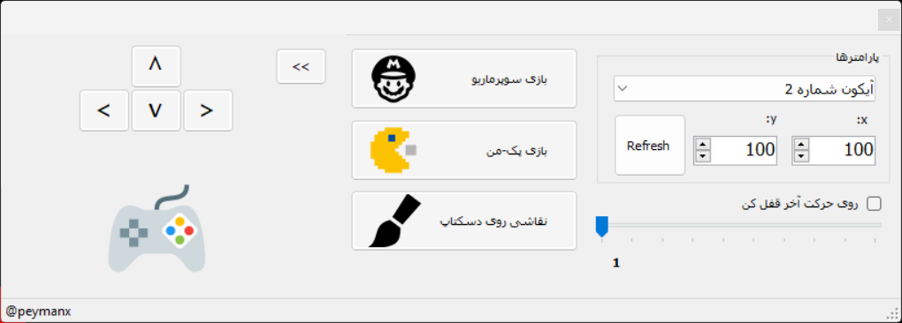
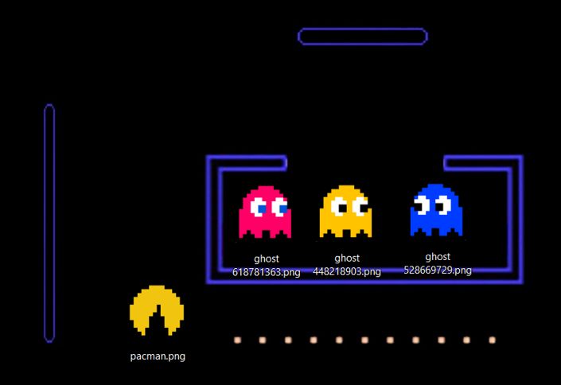
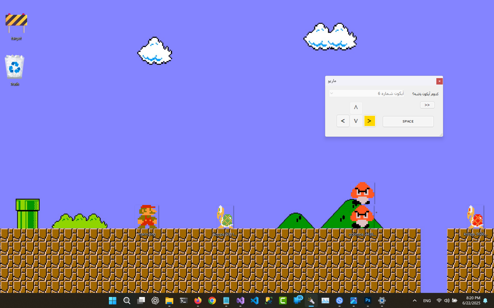
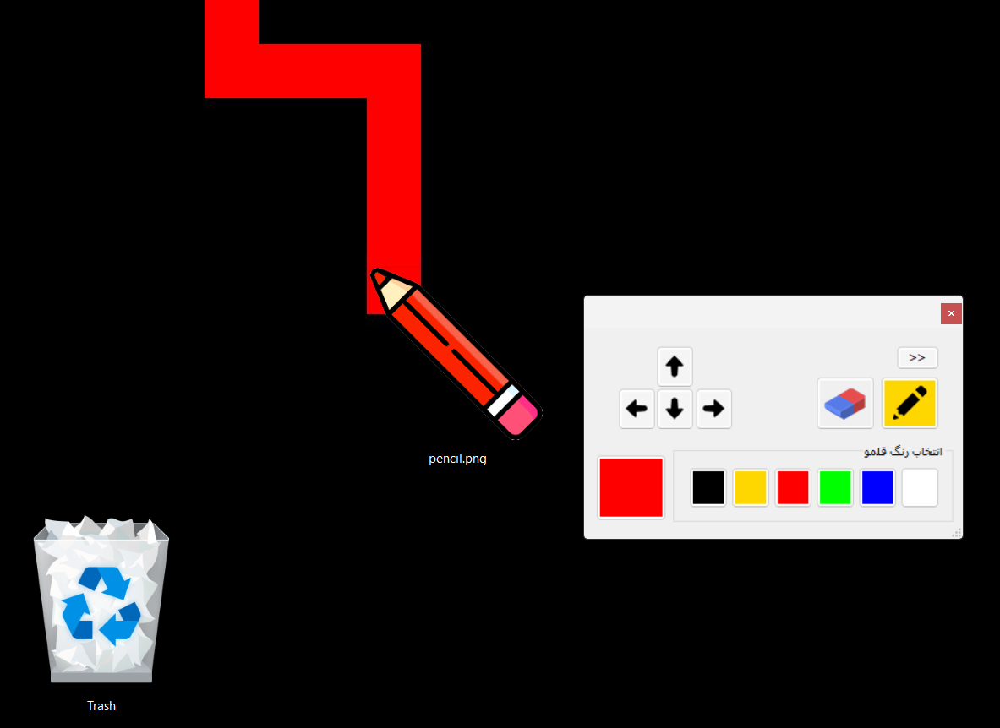

# 🎮 DesktopIconMover

**DesktopIconMover** is a creative playground where your Windows desktop icons come to life! This application turns your desktop into an interactive canvas—allowing you to play games like **Pac-Man** and **Super Mario**, or even **paint** by moving real desktop icons.   

[Download Now](https://github.com/peymanx/DesktopIconMover/releases/download/beta/Desktop.Icon.Mover.X.exe)
## 🧩 Features

- 🟡 **Play Pac-Man** using desktop icons as game pieces  
- 🍄 **Run Super Mario** across your actual desktop  
- 🎨 **Draw with icons**, transforming your desktop into a pixel art canvas  
- ⚙️ Direct control of desktop icons using low-level Windows messaging and memory manipulation  
- 📁 Supports both user and public desktop folders

## 🚀 Technologies Used

- **Language**: C# (.NET Framework)  
- **Platform**: Windows  
- **Interop**: P/Invoke to access native **Win32 API** functions  
- **APIs used**:
  - `FindWindow`, `FindWindowEx`, `SendMessage` for locating and controlling the desktop's `SysListView32`
  - `LVM_GETITEMPOSITION`, `LVM_SETITEMPOSITION`, and related constants for querying and moving icons  
  - `Marshal` and `[StructLayout]` to handle low-level memory structures and pointer access

> By combining native Windows API access with creative logic, this app repurposes your desktop into something wildly interactive—whether it's for fun, chaos, or visual delight.

## 🖼️ Screenshots

### Pac-Man  

### Super Mario  
Play Super Mario directly on your desktop.  

### Paint Mode  
Draw pixel-style images using icon placement.  

## 💡 Inspiration

Ever wondered what would happen if your desktop icons stopped being static? *DesktopIconMover* answers that question—turning your workspace into a digital playground.

---

Feel free to contribute, fork, or just have fun with it!   
Related to [peymanx youtube channel](https://Youtube.com/@peymanx)
