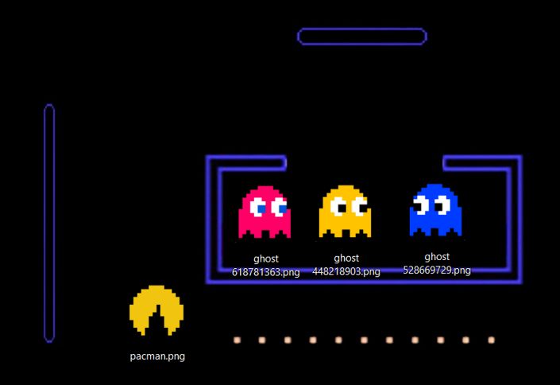
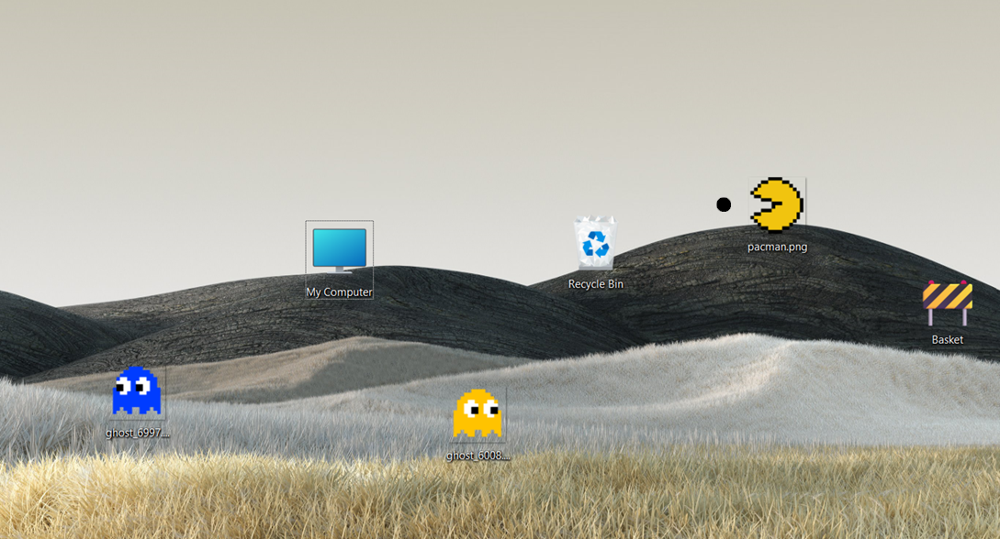

# 🟡 Pac-Man on Desktop Icons

**Pac-Man, but on your Windows desktop!**  
This experimental and fun C# Windows Forms project lets you control a Pac-Man character over your **actual desktop icons** — using them as points in a virtual maze!

 

---

## 🎮 Features

- Control Pac-Man over your desktop with arrow keys or UI buttons  
- Moves real desktop icons in real-time  
- Pac-Man image updates based on direction  
- Dot-eating animation using background drawing  
- Ghosts can be dropped onto the desktop as `.png` files  
- Sound effects using NAudio (e.g., starting sound)

## How it works

|             Player 1             |             Player 2             |             Blinky             |            Pinky             |            Inky            |            Clyde             |
| :------------------------------: | :------------------------------: | :----------------------------: | :--------------------------: | :------------------------: | :--------------------------: |
|  |  |  |  |  |  |

### Pacman

Pacman is the only player-controllable character in the game. He is the star of this show, and his goal is to eat all of the pellets inside the maze, all while avoiding being caught by the ghosts.

#### Gaining points

You may notice, however, that there are multiple types of "edible" tiles in the maze, such as regular pellets, which we'll call food, power pellets and fruit. Each kind of edible item has a different number of points associated to it, but not all are equally important. The game requires that pacman eats all FOOD tiles, meaning that Power Pellets and Fruits can very well remain uneaten and the game will still end if there are no more food tiles left.

| Icon                              | Tile Name        | Effect                                      |
| :-------------------------------- | :--------------- | :------------------------------------------ |
|         | Food             | Grants Pacman +5 extra points               |
|     | Power Pellet     | Grants Pacman the ability to "eat" ghosts\* |
|      | Fruit            | Grants Pacman +100 extra points             |
|  | Frightened Ghost | Grants Pacman +200 extra points             |

## 🛠 How it Works

This game manipulates the Windows desktop directly by:
- Accessing the **ListView** handle of the desktop icons  
- Reading and updating icon positions via **Windows API (SendMessage)**  
- Drawing Pac-Man and game effects using a **custom full-screen bitmap**  
- Updating the actual **desktop wallpaper** to reflect game changes  
- Playing sounds using **NAudio**  
- All logic wrapped in a user-friendly **Windows Forms UI**

> ⚠️ This only works on **Windows** desktops with icon auto-arrange turned off.


## ▶️ How to Run

1. Clone the repository  
   ```bash
   git clone https://github.com/yourusername/pacman-desktop-icons.git
   ```

2. Open the `.sln` file in Visual Studio
3. Build & run the project
4. Use arrow keys or on-screen buttons to start eating your desktop icons!

 


## 🤝 Contributing

Contributions, bug reports, and feature suggestions are welcome!

* Fork this repository
* Create your feature branch (`git checkout -b feature/AmazingFeature`)
* Commit your changes (`git commit -m 'Add some feature'`)
* Push to the branch (`git push origin feature/AmazingFeature`)
* Open a pull request


## 📄 License

This project is provided for educational and experimental use. Contact me for reuse in commercial projects.


